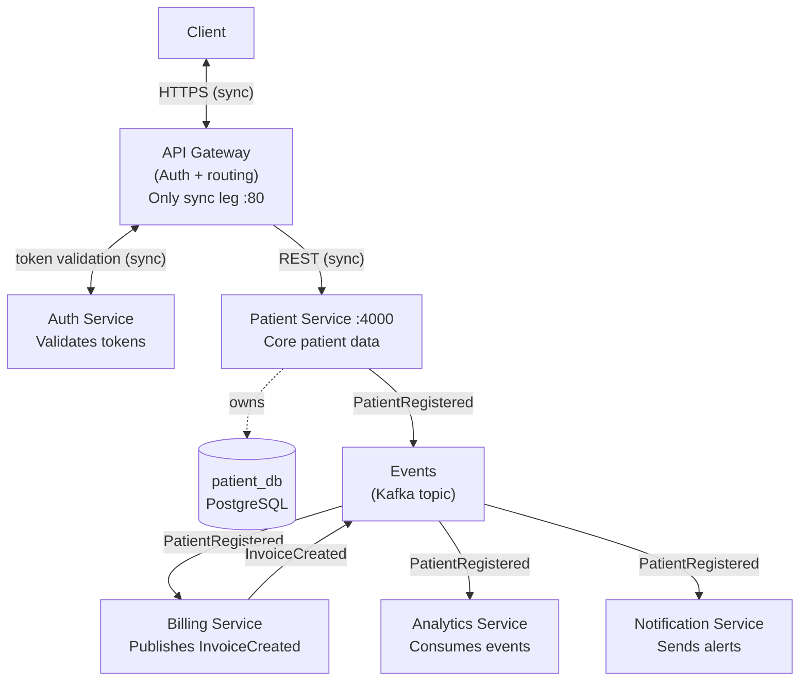

# architecture.md — Patient-Management-System (System Level)

> **Source of truth image:** `../event_driven_patient_management_architecture.png` (repo root)
> The Mermaid diagram below is the editable, queryable version of that image.
> Keep both in sync when adding new services.

---

## Full System Architecture



---

## Key Architectural Principles

### 1. Only Sync Leg
`Client ↔ API Gateway ↔ Patient Service` is the only synchronous call chain.
The client waits for a response from this path. **Everything below Patient Service is async.**

### 2. Outbox Pattern (Event Publishing)
Patient Service never calls Kafka directly inside a business transaction. Instead:
1. A `Patient` row and an `OutboxEvent` row are written **atomically** in a single DB transaction.
2. A **poller** (scheduled task) or **Debezium CDC** reads un-published outbox rows.
3. The poller publishes the event to Kafka and marks the row as published.
4. Consumers receive `PatientRegistered` events **idempotently** (at-least-once delivery).

This guarantees consistency between DB state and event state without a distributed transaction.

### 3. Database-per-Service
Each service owns its own DB schema. No service reads another service's database directly.
All inter-service communication goes through the Kafka event bus.

### 4. Billing is Both Producer and Consumer
Billing consumes `PatientRegistered` → creates an invoice → publishes `InvoiceCreated`.
This secondary event is then consumed by Analytics and Notification.

### 5. Auth Flows Through Gateway Only
Auth Service is called only by API Gateway for token validation.
Downstream services (Patient, Billing, etc.) receive pre-validated JWT claims
forwarded by the Gateway — they do not call Auth Service directly.

---

## Event Contracts

### `PatientRegistered`
Published by: **Patient Service**
Consumed by: Billing, Analytics, Notification

```json
{
  "eventType": "PatientRegistered",
  "patientId": "<uuid>",
  "name": "string",
  "email": "string",
  "phone": "string | null",
  "address": "string | null",
  "birthDate": "YYYY-MM-DD",
  "registeredAt": "ISO-8601 datetime",
  "createdBy": "string"
}
```

### `InvoiceCreated`
Published by: **Billing Service**
Consumed by: Analytics, Notification

```json
{
  "eventType": "InvoiceCreated",
  "invoiceId": "<uuid>",
  "patientId": "<uuid>",
  "amount": "decimal",
  "currency": "string",
  "createdAt": "ISO-8601 datetime"
}
```

> **Schema format TBD:** JSON (current plan) vs Avro + Schema Registry (production target).

---

## Service Interaction Summary

| Caller / Publisher  | Target / Topic        | Protocol  | Direction  |
|---------------------|-----------------------|-----------|------------|
| Client              | API Gateway           | HTTPS     | Sync ↔     |
| API Gateway         | Auth Service          | HTTP      | Sync ↔     |
| API Gateway         | Patient Service       | REST/HTTP | Sync →     |
| Patient Service     | `Events` Kafka topic  | Kafka     | Async →    |
| Billing Service     | `Events` Kafka topic  | Kafka     | Async ↔    |
| Analytics Service   | `Events` Kafka topic  | Kafka     | Async ←    |
| Notification Service| `Events` Kafka topic  | Kafka     | Async ←    |

---

## Infrastructure Targets

| Layer            | Local / Test                 | Production              |
|------------------|------------------------------|-------------------------|
| DB (per service) | H2 in-memory (PostgreSQL mode)| PostgreSQL              |
| Kafka            | None / EmbeddedKafka (tests) | AWS MSK                 |
| Auth             | Stub (`AuditorAware→"system"`)| AWS Cognito + JWT       |
| API Gateway      | N/A                          | Spring Cloud Gateway    |
| Schema migration | Hibernate `ddl-auto=update`  | Flyway                  |
| Container        | Local JVM / Docker Compose   | Kubernetes / ECS        |

---

## Per-Service Architecture Links

- [Patient-Service internal architecture](../Patient-Service/.gemini/architecture.md)
- *(Billing-Service — to be created)*
- *(Analytics-Service — to be created)*
- *(Notification-Service — to be created)*
- *(API-Gateway — to be created)*
- *(Auth-Service — to be created)*
