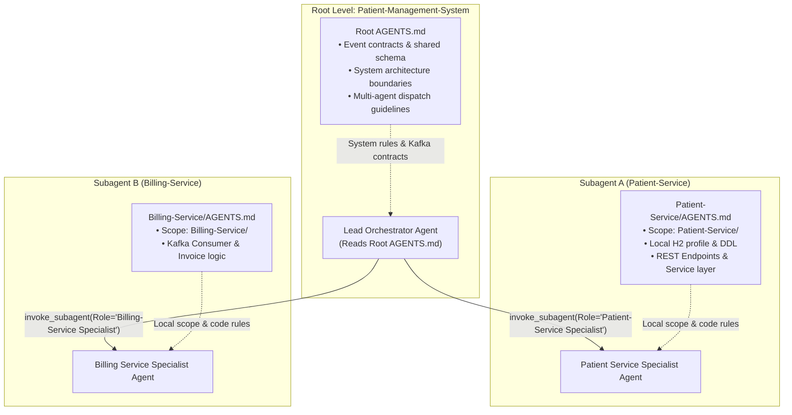

# AGENTS.md — System-Level AI Agent & Developer Guidelines

> **Scope:** Repository-wide (Mono-Repo: `Patient-Management-System/`)  
> **Purpose:** Authoritative system guidelines, multi-agent parallel execution architecture, cross-cutting contracts, Git workflow standards, and slash command recommendations for AI agents and human developers.

---

## 1. System Overview & Monorepo Architecture

`Patient-Management-System` is an **event-driven patient management platform** built with Java 21 + Spring Boot + Apache Kafka.

### Architectural Rules
1. **Single Synchronous Leg**: `Client → API Gateway → Patient Service`. All downstream services communicate **asynchronously** via Kafka.
2. **Database-per-Service**: Each microservice owns its private database. Services NEVER execute cross-database queries or read directly from another service's database.
3. **Outbox Pattern for Messaging**: Services never write directly to Kafka inside a business database transaction. Business data and `OutboxEvent` records are written in a single local database transaction. An outbox poller/CDC engine publishes to Kafka.
4. **Primary Keys**: UUID everywhere across all services (`@GeneratedValue(strategy = GenerationType.UUID)`).

---

## 2. Microservice Inventory & Status

| Service | Directory | Status | Port | Role & Responsibilities |
| :--- | :--- | :--- | :--- | :--- |
| **API Gateway** | `API-Gateway/` | 🔲 Planned | 80 | Synchronous client entry point, Auth & route dispatch |
| **Auth Service** | `Auth-Service/` | 🔲 Planned | TBD | Token validation & authentication on behalf of Gateway |
| **Patient Service** | `Patient-Service/` | ✅ Active | 4000 | Authoritative patient source of truth, publishes `PatientRegistered` |
| **Billing Service** | `Billing-Service/` | 🔲 Planned | 4001 | Consumes `PatientRegistered`, generates invoices, publishes `InvoiceCreated` |
| **Analytics Service** | `Analytics-Service/` | 🔲 Planned | 4002 | Read-only consumer of all system domain events |
| **Notification Service** | `Notification-Service/` | 🔲 Planned | 4003 | Consumer of domain events, sends email/SMS alerts |

---

## 3. Multi-Agent Parallel Execution Guide

When solving multi-service tasks, AI agents MUST follow this hierarchical orchestration strategy:



### Rules for Multi-Agent Parallel Execution
1. **Context Isolation**: Each worker subagent MUST operate strictly inside its target service directory (e.g. `Patient-Service/`).
2. **Contract Protection**: Subagents MUST NOT alter shared Kafka event payloads or API gateway contracts without parent agent coordination.
3. **Local Test Execution**: Each subagent runs unit & slice tests locally within its own service directory using `./mvnw clean test`.
4. **Workspace Mode**: Launch subagents with `Workspace: "share"` or `"branch"` to ensure workspace isolation without duplicating storage.

---

## 4. Cross-Cutting Event Contracts

All domain events flow through Kafka topic `Events` using JSON payloads:

### `PatientRegistered` Event Contract (Producer: Patient-Service)
```json
{
  "eventId": "UUID",
  "eventType": "PatientRegistered",
  "aggregateId": "UUID",
  "timestamp": "2026-09-05T17:45:00Z",
  "payload": {
    "patientId": "UUID",
    "name": "String",
    "email": "String",
    "phone": "String",
    "regDate": "YYYY-MM-DD"
  }
}
```

### `InvoiceCreated` Event Contract (Producer: Billing-Service)
```json
{
  "eventId": "UUID",
  "eventType": "InvoiceCreated",
  "aggregateId": "UUID",
  "timestamp": "2026-09-05T17:45:00Z",
  "payload": {
    "invoiceId": "UUID",
    "patientId": "UUID",
    "amount": 150.00,
    "dueDate": "YYYY-MM-DD"
  }
}
```

---

## 5. Git & Workflow Standards

AI agents MUST follow the repository's [`code-review-commit-push`](file:///D:/study/projects/Patient-Management-System/Patient-Service/.gemini/skills/code-review-commit-push/SKILL.md) skill:

1. **Logical Atomic Staging**: Group changes by concern before committing. Never run `git add .` indiscriminately.
2. **Conventional Commits Format**:
   ```
   <type>(<scope>): <imperative short description>
   ```
   - Types: `feat`, `fix`, `docs`, `test`, `refactor`, `chore`, `build`
   - Scopes: `patient-service`, `config`, `model`, `seed`, `test`, `docs`, `api-request`
3. **Verification Before Claiming Success**: Always execute `./mvnw clean test` in affected services before committing.

---

## 6. Recommended Slash Commands

Agents should recommend relevant slash commands to users when appropriate:
- `/plan`: Request technical design alignment before starting complex multi-step changes.
- `/goal`: Run extra-thorough, long-running agent tasks.
- `/schedule`: Set reminders or recurring task schedules.
- `/grill-me`: Perform an interactive design interview to resolve ambiguities.
- `/boost`: Enable deep multi-perspective reasoning on complex tasks.
- `/learn`: Save workspace setup knowledge or agent corrections.
