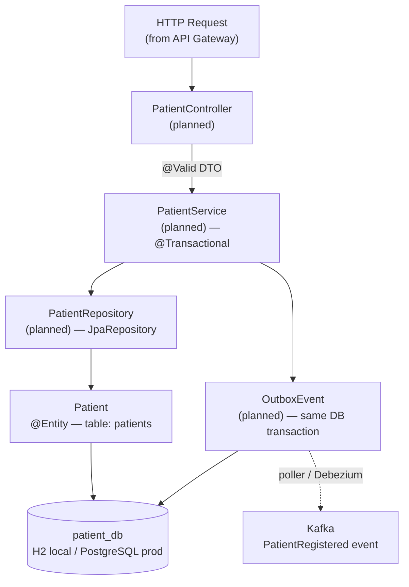

# architecture.md — Patient-Service

> **Scope:** This file covers Patient-Service internal architecture only.
> For the full system architecture (all 6 services, Kafka topology, event contracts),
> see the repo root: `.gemini/architecture.md`

## Patient-Service in the System

Patient-Service sits at the centre of the event-driven architecture:
- Receives REST calls **synchronously** from the API Gateway (the only sync leg).
- Publishes `PatientRegistered` **asynchronously** to the Kafka event bus via the Outbox Pattern.
- Billing, Analytics, and Notification all react to that event downstream.

## Internal Layer Architecture



## Patient-Service — Internal Layers

```
PatientServiceApplication   ← Spring Boot entry point
│
├── config/
│   └── JpaAuditingConfig   ← Enables @CreatedBy / @LastModifiedBy
│                             AuditorAware stub returns "system"
│
└── models/
    └── Patient             ← @Entity  table=patients
        ├── id         UUID   PK, auto-generated (Hibernate UUID strategy)
        ├── name       VARCHAR(150)  @NotBlank
        ├── email      VARCHAR(150)  @Email @NotBlank UNIQUE
        ├── phone      VARCHAR(20)
        ├── address    VARCHAR(255)
        ├── birthDate  DATE          @Past
        ├── regDate    DATE          defaulted to NOW() via @PrePersist
        ├── createdBy  VARCHAR(100)  @CreatedBy (auditing)
        ├── createdAt  TIMESTAMP     @CreationTimestamp
        ├── updatedBy  VARCHAR(100)  @LastModifiedBy (auditing)
        └── updatedAt  TIMESTAMP     @UpdateTimestamp
```

## Data Flow — Create Patient

```
POST /patients (planned)
    │
    ▼
PatientController.createPatient(PatientRequestDTO)
    │  validates (@Valid)
    ▼
PatientService.createPatient(dto)
    │  maps DTO → Patient entity
    ▼
PatientRepository.save(patient)
    │  Hibernate fires @PrePersist → sets regDate
    │  JPA Auditing fills createdBy / createdAt
    │  UUID generated by Hibernate
    ▼
patients table (H2 / PostgreSQL)
    │
    ▼  (planned — outbox pattern)
OutboxEvent inserted in same transaction
    │
    ▼
OutboxPoller publishes to Kafka topic: patient.events
    │
    ▼
Downstream consumers (Billing, Notification, Analytics …)
```

## Outbox Pattern (Planned)

The outbox pattern guarantees **at-least-once event delivery** without
distributed transactions:

1. The `Patient` write and an `OutboxEvent` row are saved in a **single DB transaction**.
2. A **poller** (scheduled task or Debezium CDC) reads unpublished outbox rows.
3. The poller publishes the event to Kafka and marks the row as published.
4. Consumers receive `patient.created` / `patient.updated` events idempotently.

## Database Schema

```sql
CREATE TABLE patients (
    id          UUID         PRIMARY KEY,
    name        VARCHAR(150) NOT NULL,
    email       VARCHAR(150) NOT NULL UNIQUE,
    phone       VARCHAR(20),
    address     VARCHAR(255),
    birth_date  DATE         NOT NULL,
    reg_date    DATE         NOT NULL,
    created_by  VARCHAR(100),
    created_at  TIMESTAMP    NOT NULL,
    updated_by  VARCHAR(100),
    updated_at  TIMESTAMP
);
CREATE UNIQUE INDEX idx_patients_email ON patients(email);
```

## Profile → Infrastructure Mapping

```
Profile   DB                          Flyway   DDL-auto   data.sql
──────────────────────────────────────────────────────────────────────
test      H2 mem (MODE=PostgreSQL)    OFF      update     loaded (deferred)
local     H2 mem (MODE=PostgreSQL)    OFF      update     loaded (deferred)
prod      PostgreSQL                  ON       validate   N/A (Flyway owns it)
```