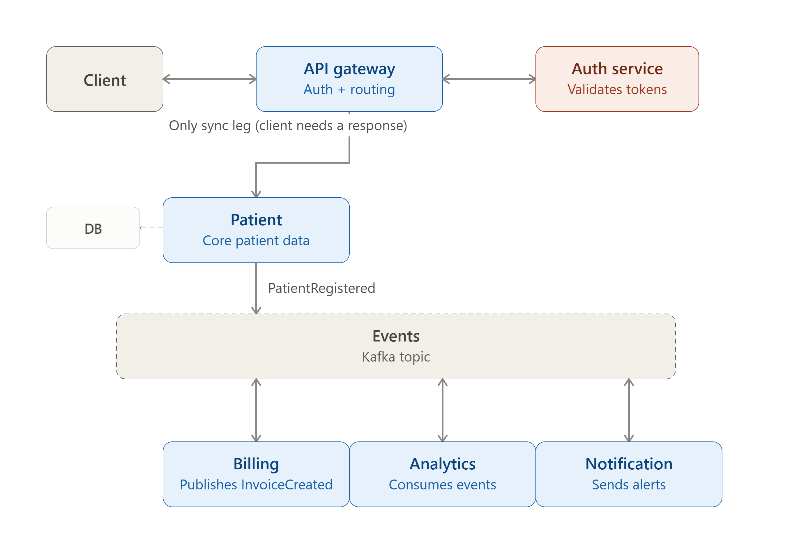

# Patient-Management-System

Event-driven patient management platform built with **Java 21 + Spring Boot + Apache Kafka**.

Patient Service is the authoritative source of truth for patient records. All downstream
services (Billing, Analytics, Notification) react asynchronously to patient domain events —
they never call Patient Service directly. The only synchronous leg is `Client → API Gateway → Patient Service`.

---

## Architecture



> See [`.gemini/architecture.md`](./.gemini/architecture.md) for the editable Mermaid version
> and full event contract definitions.

---

## Services

| Service                  | Status     | Port | Role                                                    |
|--------------------------|------------|------|---------------------------------------------------------|
| **API Gateway**          | 🔲 Planned  | 80   | Auth + routing — only synchronous client-facing entry   |
| **Auth Service**         | 🔲 Planned  | 4004 | Token validation for API Gateway                        |
| **Patient Service**      | ✅ Active   | 4000 | Core patient data + DB; publishes `PatientRegistered`   |
| **Billing Service**      | 🔲 Planned  | 4001 | Consumes `PatientRegistered`; publishes `InvoiceCreated`|
| **Analytics Service**    | 🔲 Planned  | 4002 | Consumes all events (read-only)                         |
| **Notification Service** | 🔲 Planned  | 4003 | Consumes events, sends alerts                           |

---

## Kafka Events

| Event               | Producer        | Consumers                         |
|---------------------|-----------------|-----------------------------------|
| `PatientRegistered` | Patient Service | Billing, Analytics, Notification  |
| `InvoiceCreated`    | Billing Service | Analytics, Notification           |

---

## Quick Start — Patient Service

```bash
cd Patient-Service

# Run locally (H2 in-memory + H2 console enabled)
./mvnw spring-boot:run -Dspring-boot.run.profiles=local

# H2 Console → http://localhost:4000/h2-console
# JDBC URL: jdbc:h2:mem:patient_db  |  User: sa  |  Password: (empty)

# Run all tests
./mvnw clean test
```

---

## Documentation

| Doc | Purpose |
|-----|---------|
| [`.gemini/CONTEXT.md`](./.gemini/CONTEXT.md) | Repo-wide service map, conventions, event contracts |
| [`.gemini/architecture.md`](./.gemini/architecture.md) | Full system Mermaid diagram + infra targets |
| [`Patient-Service/.gemini/CONTEXT.md`](./Patient-Service/.gemini/CONTEXT.md) | Patient-Service internals, profiles, tech stack |
| [`Patient-Service/.gemini/architecture.md`](./Patient-Service/.gemini/architecture.md) | Patient-Service layer diagram, DB schema, data flow |

---

## Conventions

- **Commits:** [Conventional Commits](https://www.conventionalcommits.org/) — `feat`, `fix`, `docs`, `refactor`, `chore`
- **Code review workflow:** See [`code-review-commit-push` SKILL](./Patient-Service/.gemini/skills/code-review-commit-push/SKILL.md)
- **Adding a new service:** See [`add-new-microservice` SKILL](./.gemini/skills/add-new-microservice/SKILL.md)
- **Daily dev loop:** See [`patient-service-dev` SKILL](./Patient-Service/.gemini/skills/patient-service-dev/SKILL.md)

---

## Tech Stack

| Layer         | Technology                          |
|---------------|-------------------------------------|
| Language      | Java 21                             |
| Framework     | Spring Boot 4.x                     |
| Persistence   | Spring Data JPA + Hibernate         |
| Event Bus     | Apache Kafka (AWS MSK in prod)      |
| Auth          | AWS Cognito + JWT                   |
| Prod DB       | PostgreSQL (per service)            |
| Test/Local DB | H2 in-memory (PostgreSQL-compat)    |
| Migrations    | Flyway (prod) / Hibernate DDL (dev) |
| Build         | Maven 3                             |
| Boilerplate   | Lombok                              |
